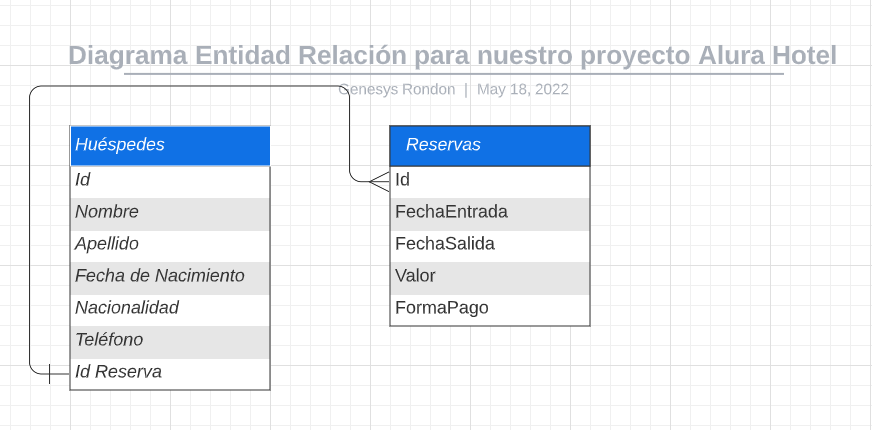

# Hotel-Alura-Reservas-Challenge-Oracle-Next-Education !

  Hotel-Alura-Reservaciones-Alura-Challenge-Oracle-Next-Education !

## Desarrollo :nerd_face:

Para el desarrollo de este proyecto se realizo el siguiente proceso, primero realice todos los trabajos pertinentes a la base de datos en base al Modelo entidad 
Relacion propuesto por alura para la base de datos:

Para eliminar los registros de la tabla huespedes y reservas en una sola consulta se creo un procedimiento almacendado:

    DELIMITER //
    CREATE PROCEDURE BorrarReservas(IN Reserva INT)
    BEGIN
    	DELETE FROM Huespedes WHERE idReserva = Reserva;
        DELETE FROM Reservas WHERE id = Reserva;
    END//

Este procedimiento almacenado se encargara de borrar el registro teniendo precausion de la llave foranea que relaciona la tabla **Huespedes** y la Tabla de **Reservas** eliminando primero el registro de Huespedes y luego de Reservas esto con el fin de que al borrar un husped no quede el registro de la reserva sin ningun huesped.
Para evitar que dos usuarios puedan agendar la misma reserva se establecio la lave Foranea de ID Reserva que se encuentra en Huespedes como de tipo UNIQUE esto permite que no hayan dos usuarios con el mismo ID de reserva.

***Recomiendo a los Compañeros el Uso de un servidor como Wamp O Xampp, esto puesto que es mas sencillo realizar las pruebas con estas herramientas debido a que traen el PHPmyAdmin incorporado lo que permite visualizar lo que va ocurriendo y nos ayuda bastante con el tema de las consultas sin conocer tanto de SQL ya que es un entorno mas grafico.***

## Problemas Presentados  :persevere:

- Tuve algunos problemas con el uso de maven lo que me impido cargar correctamente las imagenes de las vistas del programa por lo que tuve que realizar nuevamente el proyecto sin el uso de maven y exportar las librerias a usar manualmente.

- tambien tuve algunos problemas al usar el Try with resources esto relacionado con un problema de compatibilidad con mi sistema que no me permitio instalar una version del JDK Compatible con esta setencia, evidentemente esto se soluciona rapidamente si no que en el momento no quise perder tanto tiempo enfocandome en ese problema.

## Errores :anger:

- :eye_speech_bubble:  Aunque ya el software realiza la tarea encomendada aun tengo algunos problemas por enmendar en el codigo, uno de esos problemas es en la base de datos puesto que se podrian crear tablas relacionadas para almacenar las nacionalidades y los metodos de pago esto con el fin de optimizar la base de datos e igualmente crear triggers y procedimientos almacenados para optimizar las tareas a realizar sobre la base de datos.

- :eye_speech_bubble: Tambien existe un problema en el almacenamiento del valor de la reserva lo cual probablemente solucione muy pronto puesto que  este problema al parecer esta relacionado con el tipo de dato que estoy usando para almacenar el valor de la reserva.

-  :eye_speech_bubble: Los demas problemas que se estan presentando estan relacionados con el modelo de negocio puesto que hay que configurar una regla que establezca que si el usuario modifica las fechas de la reservacion se deberia recalcular el costo de la reserva, es importante tambien establecer una regla que notifique al usuario que tanto el ID de la Reserva y el ID del usuario no pueden ser modificados.

## Agradecimientos :punch:

Agradecimientos al equipo de alura por su esfuerzo en enseñar este maravilloso mundo de la programacion; igualmente al equipo de Oracle Next Education por esta increible oportunidad, Tambien agradezco  a los compañeros puesto que tambien es en base al aporte de todos en comunidad lo que permite el avance de todos como grupo.

**:sunglasses: Desarrollado por Daniel Quintero Henriquez**
